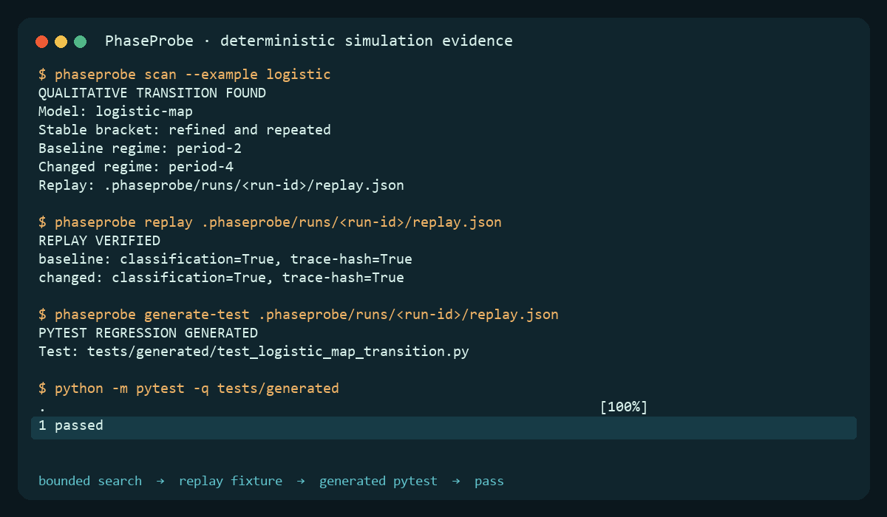
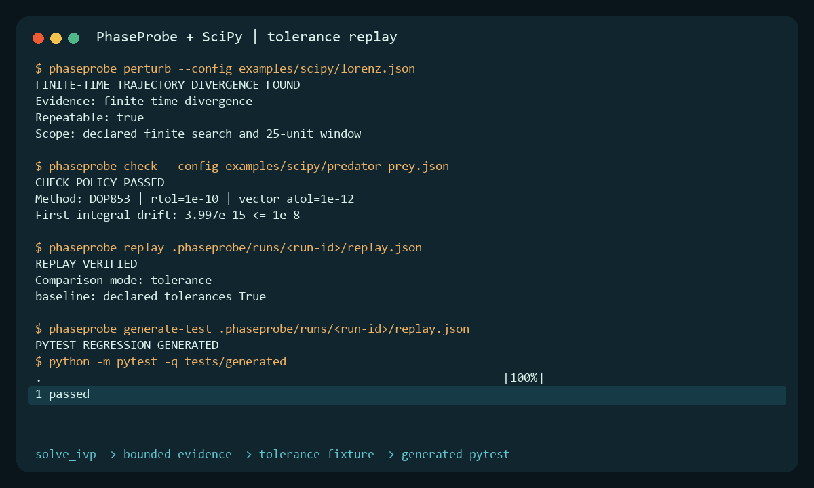

# PhaseProbe

> Find a simulation behavior boundary. Preserve it as a replay. Turn it into a test.

Maintaining a simulation is risky when a tiny parameter or initial-condition change can cross a qualitative boundary while ordinary numeric assertions still look plausible. PhaseProbe runs a bounded, deterministic search, records exactly what it tested, and emits an offline report plus an executable pytest regression.

```console
$ pip install phaseprobe pytest
$ phaseprobe scan --example logistic
QUALITATIVE TRANSITION FOUND

Model: logistic-map
Search dimension: r
Baseline regime: period-2
Changed regime: period-4
Replay: .phaseprobe/runs/<run-id>/replay.json

$ phaseprobe generate-test .phaseprobe/runs/<run-id>/replay.json
$ python -m pytest -q tests/generated
1 passed
```

[](assets/demo.gif)

No API key, LLM, GPU, Docker, account, telemetry, network connection, or hosted service is required at runtime. PhaseProbe's base installation has no third-party runtime dependencies; NumPy and SciPy are isolated in the optional `scipy` extra.

## Installation

```bash
pip install phaseprobe
pip install "phaseprobe[scipy]"
pip install pytest  # needed only to execute a generated regression test
```

## Five-minute quick start

Requires Python 3.10 or newer on Windows or Linux.

```bash
pip install phaseprobe pytest
phaseprobe scan --example logistic
phaseprobe replay .phaseprobe/runs/<run-id>/replay.json
phaseprobe generate-test .phaseprobe/runs/<run-id>/replay.json
python -m pytest -q tests/generated
phaseprobe report .phaseprobe/runs/<run-id>
```

Replace `<run-id>` with the directory printed by `scan`. The scan returns `0` when it successfully finds a transition. Add `--fail-on-finding` only when a finding should fail CI.

The quick-start evidence is empirical: the built-in classifier finds a finite-time period-2/period-4 bracket for the logistic map, performs bounded binary refinement, repeats both endpoints, saves trace hashes and a versioned fixture, and generates a fixed pytest template. It does not claim an exact bifurcation point.

## Use with SciPy

SciPy integrates trajectories. PhaseProbe searches declared dimensions, preserves qualitative
boundaries, and creates regressions. PhaseProbe is an independent project and does not imply
endorsement by SciPy.

Five-minute path:

[](assets/scipy-demo.gif)

The verified command transcript is [assets/scipy-demo-session.txt](assets/scipy-demo-session.txt),
with a self-contained [HTML example report](examples/scipy/report.html). The following path starts
from a clean environment and does not require a source checkout:

```bash
python -m venv .venv
# Linux: source .venv/bin/activate
# Windows PowerShell: .venv\Scripts\Activate.ps1
python -m pip install "phaseprobe[scipy]" "pytest==8.4.1"
phaseprobe perturb --example scipy-lorenz
phaseprobe check --example scipy-predator-prey
phaseprobe replay .phaseprobe/runs/<run-id>/replay.json
phaseprobe generate-test .phaseprobe/runs/<run-id>/replay.json
python -m pytest -q tests/generated
```

PhaseProbe 0.2.1 also recognizes the former Issue #4 command
`phaseprobe perturb --config examples/scipy/lorenz.json` when that relative file is absent and
loads the corresponding packaged example. This compatibility is limited to the four former
`examples/scipy/` paths: an existing file always takes precedence, matching is case-sensitive,
both slash styles are accepted, and unrelated missing paths remain errors. New documentation and
automation should use the installed-safe `--example scipy-*` names.

The Lorenz command searches a declared initial-`x` perturbation and reports only finite-time
divergence evidence and prints `FINITE-TIME TRAJECTORY DIVERGENCE FOUND`. Its installed
short-window control is `--example scipy-lorenz-negative`. The predator–prey command checks the
declared first integral with tightly resolved DOP853 settings and prints `CHECK POLICY PASSED`;
`--example scipy-predator-prey-coarse` deliberately fails the same policy with loose RK23 settings.
Each successful command writes a replay fixture and offline report below
`.phaseprobe/runs/<run-id>/`.

Run `phaseprobe perturb --help` or `phaseprobe check --help` to list installed example names. A
missing packaged resource reports the PhaseProbe version and resource name. Adaptive SciPy replay
compares the declared state, observable, invariant, endpoint, event, and retained-grid
tolerances—it does not promise bitwise trajectory equality across platforms or dependency
versions.

For a direct Python API:

```python
from phaseprobe import run_perturbation
from phaseprobe.adapters.scipy import SolveIVPAdapter

adapter = SolveIVPAdapter(
    name="lorenz-scipy",
    identity="my-lorenz-v1",
    rhs=lorenz_rhs,
    state_names=("x", "y", "z"),
    initial_state=(1.0, 1.0, 1.0),
    t_span=(0.0, 25.0),
    t_eval=1001,
    method="DOP853",
    rtol=1e-9,
    atol=1e-12,
    max_step=0.05,
    classifier=classify_lorenz,
)

outcome = run_perturbation(adapter, config)
```

JSON CLI configurations name an absolute dotted Python module and factory. Running, replaying, or
generating from that configuration executes the selected trusted Python code; validation alone
does not import it. See [the audited contract](docs/SCIPY_SOLVE_IVP_AUDIT.md),
[architecture](ARCHITECTURE.md), and [security boundary](SECURITY.md).

## Commands

| command | job | normal success |
| --- | --- | --- |
| `scan` | Bounded one-dimensional parameter scan, adjacent class-change detection, and stable bracket refinement | Finding or no finding, exit `0` |
| `perturb` | Baseline/perturbed twin runs over bounded initial-state changes | Finding or no finding, exit `0` |
| `check` | Execute a declared configuration policy for CI | Exit `1` only when policy fails |
| `replay` | Validate fixture integrity and re-execute model, parameters, seed, initial state, tolerances, and retention | Declared `exact` or `tolerance` comparison passes |
| `generate-test` | Validate and copy a fixture into a non-extensible pytest template without conflicting overwrites | Executable test under `tests/generated/` |
| `report` | Regenerate terminal, versioned JSON, and self-contained offline HTML evidence | Local report files |

Common options:

```console
phaseprobe scan --config examples/configs/logistic-scan.json
phaseprobe perturb --example lorenz --json
phaseprobe perturb --example scipy-lorenz --json
phaseprobe check --example predator-prey
phaseprobe scan --example logistic --fail-on-finding
```

Exit codes are stable: `0` completed, `1` declared policy or explicit `--fail-on-finding`, `2` invalid input/configuration, `3` numerical failure, and `4` internal PhaseProbe defect.

## Included deterministic examples

| example | command | positive evidence | negative control | direct technical source |
| --- | --- | --- | --- | --- |
| Logistic map | `phaseprobe scan --example logistic` | Finite-time period-2 to period-4 classification bracket | `--example logistic-negative` stays period-2 over its declared range | [May, 1976](https://www.nature.com/articles/261459a0) |
| Lorenz system | `phaseprobe perturb --example lorenz` | Small initial separation exceeds the declared finite-time trajectory-distance threshold | Short window plus unreachable threshold reports no finding | [Lorenz, 1963](https://journals.ametsoc.org/view/journals/atsc/20/2/1520-0469_1963_020_0130_dnf_2_0_co_2.xml) |
| Predator–prey | `phaseprobe check --example predator-prey` | Refined RK4 step preserves the analytic first integral within tolerance | Coarse step fails the invariant-drift policy | [Lotka, 1920](https://doi.org/10.1073/pnas.6.7.410) |
| Genetic toggle | `phaseprobe perturb --example toggle` | Bounded initial-state perturbation reaches the opposite dominant state | Smaller declared range stays in the baseline basin | [Gardner, Cantor & Collins, 2000](https://www.nature.com/articles/35002131) |
| SciPy Lorenz | `phaseprobe perturb --example scipy-lorenz` | DOP853 twin trajectories cross the declared finite-time distance threshold | `--example scipy-lorenz-negative` shortens the window | [Lorenz, 1963](https://journals.ametsoc.org/view/journals/atsc/20/2/1520-0469_1963_020_0130_dnf_2_0_co_2.xml) |
| SciPy predator–prey | `phaseprobe check --example scipy-predator-prey` | Tight DOP853 settings preserve the declared first integral tolerance | `--example scipy-predator-prey-coarse` deliberately fails | [Lotka, 1920](https://doi.org/10.1073/pnas.6.7.410) |

Each configuration records the seed, fixed integration/iteration settings, tolerances, burn-in, observation window, classification rule, refinement rule, invalid-state policy, and trace cap. See [examples/README.md](examples/README.md) for equations and interpretation.

### Measured reference run

On 2026-08-01 with CPython 3.12.13 on Windows, the instrumented logistic quick-start scan completed in 10.114 seconds with a 34.81 MiB peak process-tree working set. All eight positive/negative example commands completed in 12.238 seconds. The final 38-test suite with branch coverage completed in 64.86 seconds at 87.92% coverage. These are observations from one local run, not cross-machine performance claims; the generated transcript is in [assets/demo-session.txt](assets/demo-session.txt).

## Evidence artifacts

Every execution is bounded under `.phaseprobe/runs/<run-id>/`:

```text
run.json       complete versioned evidence
findings.json  compact finding or negative result
replay.json    schema-versioned integrity-protected fixture
trace.jsonl    capped baseline/changed retained points
report.html    self-contained offline report
manifest.json  sizes and SHA-256 hashes
```

Model names used for generated test paths are sanitized. The generated source comes from a fixed template; configuration strings never become executable Python.

`generate-test` validates the replay before writing anything. Alongside the fixed pytest template
and copied fixture, it writes `<model>-pytest-evidence.json`: a path-portable claim/decision record
containing repository/version attribution, the declared replay comparisons, SHA-256 hashes for
both executable artifacts, the exact pytest command, and explicit scientific limitations.

## What PhaseProbe adds—and what it does not

| existing category | established strength | PhaseProbe’s narrower job |
| --- | --- | --- |
| Solvers such as SciPy | Integrate differential equations with mature numerical methods | Consume an adapter’s trajectories and preserve a discovered qualitative boundary as test evidence |
| Property-based testing such as Hypothesis | Generate and shrink broad input domains | Search declared simulation dimensions with model-specific observables and classes |
| Bifurcation/attractor tools such as AUTO, PyDSTool, and Attractors.jl | Deep continuation, bifurcation, attractor, and basin analysis | Lightweight black-box numerical brackets plus replay and pytest materialization |
| Sensitivity tools such as SALib | Quantify input contributions to output variation | Find a reproducible qualitative predicate change |
| Simulation environments such as Mesa, NetLogo, cadCAD, and Golly | Build, run, and explore models | Test adapters without becoming another simulation environment |

The evidence-backed audit is in [PRIOR_ART.md](PRIOR_ART.md).

## Adapter interfaces

Adapters implement a small typed protocol:

```python
class ModelAdapter(Protocol):
    name: str
    identity: str
    dimensions: tuple[str, ...]

    def initial_state(self, config, seed): ...
    def step(self, state, parameters, dt): ...
    def observe(self, state): ...
    def classify(self, trace, tolerances): ...
    def invariants(self, trace, parameters, tolerances): ...
```

The explicit serializable state tuple makes bounded perturbation, invalid-value detection, trace hashing, and replay straightforward. See [ARCHITECTURE.md](ARCHITECTURE.md) for extension guidance.

Whole-trajectory solvers use the optional protocol instead of a fake step loop:

```python
class TrajectoryAdapter(Protocol):
    name: str
    identity: str
    dimensions: tuple[str, ...]
    replay_mode: Literal["exact", "tolerance"]

    def initial_state(self, config, seed): ...
    def simulate(self, initial_state, parameters, config, seed): ...
    def observe(self, trace): ...
    def classify(self, trace, tolerances): ...
    def invariants(self, trace, parameters, tolerances): ...
    def configuration(self): ...
```

`SolveIVPAdapter` records the explicit identity plus a digest of serializable numerical settings.
It never serializes or claims to securely hash arbitrary callable source.

## Scientific scope

PhaseProbe uses these terms deliberately:

- finite-time trajectory divergence: measured separation over the recorded window;
- sensitive-dependence evidence: repeatable finite-time divergence under a declared small perturbation, not by itself a proof of chaos;
- numerical instability: behavior attributable to the numerical method or step size;
- invariant violation: a declared conservation or boundedness rule failed;
- qualitative regime change: the adapter’s declared classifier changed;
- bifurcation evidence: a numerical class-change bracket, not an exact bifurcation point;
- invalid integration: NaN, infinity, overflow, state-shape mismatch, or hard bound breach;
- solver failure: the step method could not advance a valid state.

The Lorenz examples report `finite-time divergence rate`; they do not compute or claim a Lyapunov exponent. Adaptive SciPy replay is tolerance-based, never exact deterministic replay. “Smallest” always means smallest found within the declared bounded search. Read [SCIENTIFIC_METHODS.md](SCIENTIFIC_METHODS.md) and [LIMITATIONS.md](LIMITATIONS.md).

## Development

```bash
python -m pip install -e ".[dev]"
python -m pip install -e ".[dev,scipy]"  # include optional adapter tests
python -m ruff format --check .
python -m ruff check .
python -m mypy src tests
python -m pytest --cov=phaseprobe
python -m build
python scripts/check_links.py
python scripts/hygiene.py
```

See [CONTRIBUTING.md](CONTRIBUTING.md) and the concrete good-first-issue templates in `.github/ISSUE_TEMPLATE/`.

## License and citation

Apache-2.0. Copyright 2026 Ali. Citation metadata is in [CITATION.cff](CITATION.cff).
